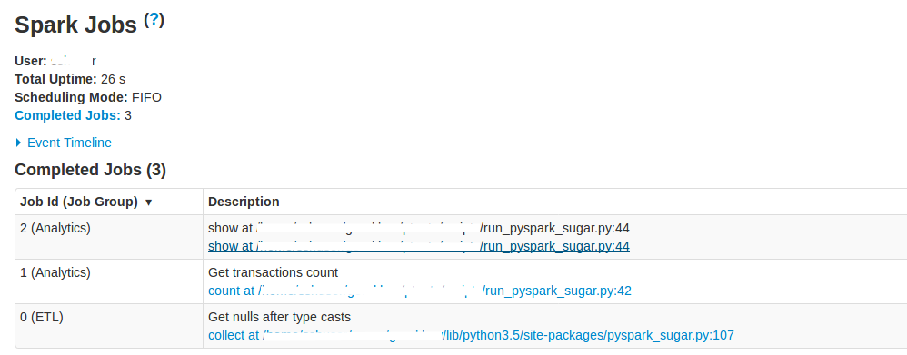
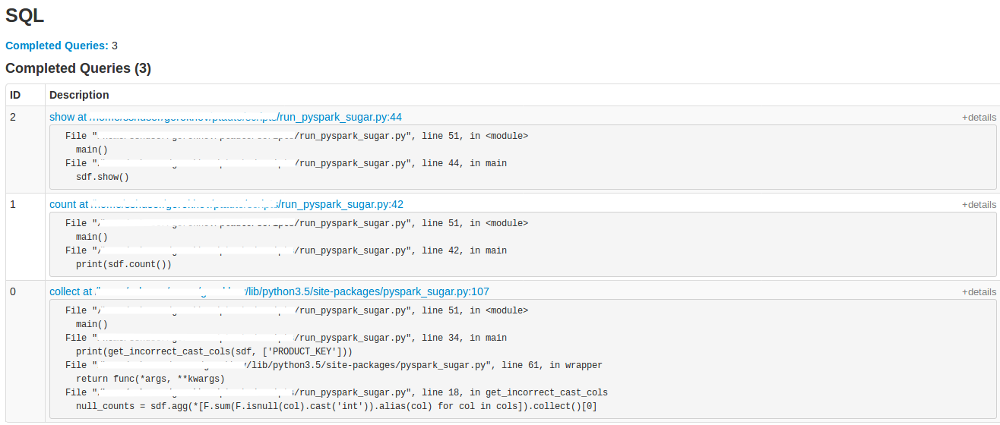

# pyspark-sugar

Set python traceback on dataframe actions, enrich spark UI with actual business logic stages of spark application.


## Installation

Via pip:
```
pip install pyspark-sugar
```

Directly from github:
```
pip install git+https://github.com/sashgorokhov/pyspark-sugar.git@master
```

## Usage


Consider this synthetic example
```python
import random

import pyspark
import pyspark_sugar
from pyspark.sql import functions as F


# Set verbose job description through decorator
@pyspark_sugar.job_description_decor('Get nulls after type casts')
def get_incorrect_cast_cols(sdf, cols):
    """
    Return columns with non-zero nulls amount across its values.

    :param cols: Subset of columns to check
    """
    cols = set(cols) & set(sdf.columns)
    if not cols:
        return {}
    null_counts = sdf.agg(*[F.sum(F.isnull(col).cast('int')).alias(col) for col in cols]).collect()[0]
    return {col: null_counts[col] for col in cols if null_counts[col]}


def main():
    sc = pyspark.SparkContext.getOrCreate()  # type: pyspark.SparkContext
    ssc = pyspark.sql.SparkSession.builder.getOrCreate()
    
    # Define a job group. All actions inside job group will be grouped.
    with pyspark_sugar.job_group('ETL', None):
        sdf = ssc.createDataFrame([
            {'CONTACT_KEY': n, 'PRODUCT_KEY': random.choice(['1', '2', 'what', None])}
            for n in range(1000)
        ]).repartition(2).cache()

        sdf = sdf.withColumn('PRODUCT_KEY', F.col('PRODUCT_KEY').cast('integer'))
        
        # Collect action inside this function will have nice and readable description
        print(get_incorrect_cast_cols(sdf, ['PRODUCT_KEY']))

        sdf = sdf.dropna(subset=['PRODUCT_KEY'])
    
    # You can define several job groups one after another.
    with pyspark_sugar.job_group('Analytics', 'Check dataframe metrics'):
        sdf.cache()
        
        # Set job description for actions made inside context manager.
        with pyspark_sugar.job_description('Get transactions count'):
            print(sdf.count())

        sdf.show()

    sc.stop()


if __name__ == '__main__':
    # Patch almost-all dataframe actions with code that will set stack trace to job details description
    with pyspark_sugar.patch_dataframe_actions():
        main()

```

This how SparkUI pages will look like:




Now SparkUI is full of human-readable descriptions so even you manager can read it! Sweet.
